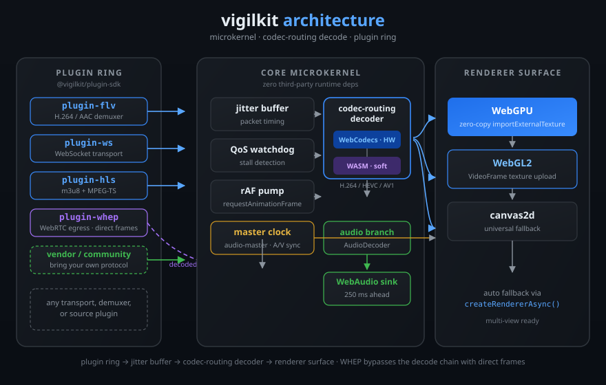

<p align="right"><b>English</b> · <a href="README.zh-CN.md">简体中文</a></p>

# vigilkit

**WebCodecs-first, plugin-based web video player SDK for surveillance and IoT video.**

A microkernel engine with zero third-party runtime dependencies. Wire transport, source, and demuxer plugins into a single decode pipeline: H.264 decodes through the browser's native WebCodecs hardware decoder and draws through WebGPU (zero-copy `importExternalTexture`), WebGL2, or canvas2d. HEVC plays through WebCodecs where hardware decode exists and through a WASM soft-decode fallback everywhere else, which is how Firefox gets HEVC. AAC audio decodes through WebCodecs `AudioDecoder` and is scheduled ahead on a WebAudio sink with audio-master A/V sync. The WHEP source plugin brings WebRTC egress streams in as direct frames. Everything runs in the browser, built for low-latency, multi-stream surveillance and IoT dashboards.

<!-- Badge row: CI / license / npm badges are live shields.io endpoints against the real repo and package.
     The "tests" and "browsers" badges are static placeholders: they will become live once a badge
     data source (CI artifact / test report) is wired up. -->
<p align="center">
  <a href="https://github.com/SnowCrescenter-tech/vigilkit/actions"></a>
  <a href="https://www.npmjs.com/package/vigilkit"></a>
  <a href="LICENSE"></a>
  <a href="#testing"></a>
  <a href="#browser-support-v03"></a>
  <a href="CONTRIBUTING.md"></a>
</p>

**Status: v0.3 complete.** The rAF playback pump, AAC audio playback with a WebAudio sink and audio-master A/V sync, and the WHEP (WebRTC) source plugin are done and verified. Unit tests, e2e (chromium + firefox), and license scan all green. Next up: v0.4 (see [Roadmap](#roadmap)).

---

## Features

| Decode & render | Sources & transports | Engine |
| --- | --- | --- |
| H.264 / HEVC / AV1 via **WebCodecs** (hardware) | **FLV** demuxer plugin (H.264/AAC) | Microkernel core with zero third-party runtime dependencies |
| HEVC **soft-decode fallback** via libde265 WASM (Firefox) | **WS** WebSocket transport (`ws`/`wss`) | Codec-routing decoder with async `isConfigSupported` probe |
| **WebGPU** zero-copy `importExternalTexture` rendering | **HLS** source plugin (m3u8 + MPEG-TS, VOD + live + ABR) | rAF playback pump with hidden-tab fallback |
| **WebGL2** and **canvas2d** renderer fallbacks | **WHEP** (WebRTC egress) direct-frame source plugin | Jitter buffer + QoS stall detection |
| AAC audio via WebCodecs `AudioDecoder` + WebAudio sink | Any custom protocol via `@vigilkit/plugin-sdk` | Audio-master A/V sync (`MasterClock`) |

## Zero telemetry

**vigilkit collects no telemetry. No analytics, no tracking, no usage counters, no beacons.** All code runs in the browser, and vigilkit never makes a network call other than the stream URL your application asks it to connect to. There is no vigilkit-operated server, no phone-home endpoint, and no data leaves your page.

## Open-core / business model

- The core engine (`vigilkit`), the plugin SDK, and the standard plugin set are **Apache-2.0 forever**. This project will never paywall the core.
- The only commercial surface is a closed set of enterprise add-ons (multi-view layouts, recording, encrypted streams, PTZ control) and vendor-protocol customization for the Hikvision, Dahua, and Uniview surveillance platforms.
- Community contributions to general and long-tail protocol plugins (WHEP, MQTT, and more) are welcome; HLS and WHEP are already shipped as source plugins. The three major vendor plugins are developed by the core team; see [CONTRIBUTING.md](CONTRIBUTING.md) for the exact boundary.

## Try it

Run the example app locally (Prerequisites: Node.js 20+ and pnpm 9+):

```sh
pnpm install
pnpm --filter @vigilkit/example-basic build
pnpm --filter @vigilkit/example-basic serve
```

Open <http://localhost:8080>. If port 8080 is busy, pass a custom port:

```sh
pnpm --filter @vigilkit/example-basic serve -- --port 9000
```

The example app supports four demo modes, selected with the `source` query parameter:

| Mode | URL | What plays |
| --- | --- | --- |
| FLV (default) | `?source=flv` | WS-FLV, engine pipeline |
| HLS | `?source=hls` | HLS m3u8 + MPEG-TS via the source plugin |
| HEVC | `?source=hevc` | HEVC soft-decode via libde265 WASM (works in Firefox) |
| WHEP | `?source=whep&endpoint=<resource-url>` | WebRTC egress via the WHEP source plugin (needs a WHEP server, e.g. MediaMTX) |

## Install from npm

All packages are published on npm. Install the engine plus the plugins you need:

```sh
npm install vigilkit @vigilkit/plugin-flv @vigilkit/plugin-ws @vigilkit/renderer
# or pnpm add / yarn add
```

Basic usage:

```ts
import { createPlayer } from 'vigilkit';
import { flvDemuxerPlugin } from '@vigilkit/plugin-flv';
import { wsTransportPlugin } from '@vigilkit/plugin-ws';
import { createRenderer } from '@vigilkit/renderer';

const player = createPlayer({
  url: 'ws://your-server/live',
  demuxer: 'flv',
  plugins: [wsTransportPlugin(), flvDemuxerPlugin()],
  renderer: createRenderer(canvas), // a <canvas> element
});

player.play();
```

> **Note:** all packages are **ESM-only**. Tooling (bundlers, dev servers) requires Node.js 20+; the browser needs WebCodecs plus WebGPU, WebGL2, or canvas2d for rendering.

## Architecture

vigilkit is a microkernel. The engine itself knows nothing about transports or container formats; plugins supply them through the plugin SDK, and the engine owns the timing and rendering path.

Source plugins produce a `MediaSource` that demuxes a whole container (HLS, FLV over HTTP, WHEP); transport plugins feed raw bytes to a demuxer plugin (WS-FLV); both emit the same demuxer event stream. The engine routes encoded chunks through a codec-routing decoder that prefers WebCodecs and falls back to a soft decoder (e.g. libde265 WASM for HEVC) when the browser cannot decode the codec, and routes audio chunks into a parallel WebAudio branch:



The playback pump is rAF-driven: `requestAnimationFrame` is the primary driver in browsers, with a `setInterval(30ms)` fallback in runtimes without rAF (Node, workers) and a 250ms interval while the tab is hidden so decode and backpressure keep draining without burning battery. The drivers are injectable via `PlayerOptions.pump` (`requestFrame` / `cancelFrame`).

WHEP is the exception to the pipeline above: it delivers already-decoded `VideoFrame`s as direct `frame` events that bypass the encoded decode chain entirely (see [WHEP (WebRTC)](#whep-webrtc)).

| Package | Description |
| --- | --- |
| `vigilkit` | Core microkernel engine: AV sync, jitter buffer, decode scheduling, `CodecRoutingDecoder` (WebCodecs-first with async `isConfigSupported` probe, buffered decodes, soft-decoder fallback, `forceSoft` option), source-plugin branch, rAF playback pump (`PlayerOptions.pump`), audio pipeline (`AudioDecoderWrapper` → WebAudio sink, `PlayerOptions.audio`, audio-master `MasterClock`), direct-frame path for WHEP-style sources, `PlayerOptions.softDecoder` / `sourceOptions`. Zero third-party runtime dependencies. |
| `@vigilkit/plugin-sdk` | Plugin contract types (transport, demuxer, source) and the plugin registry. |
| `@vigilkit/media-utils` | Shared byte-reader / NALU / AVC helpers for demuxer plugins (FLV and HLS both build on it). |
| `@vigilkit/plugin-flv` | FLV demuxer plugin (H.264/AAC), refactored onto `media-utils`; AAC sequence header → `audio-config` (ASC) + raw AAC chunks. |
| `@vigilkit/plugin-ws` | WebSocket transport plugin (`ws` / `wss`). |
| `@vigilkit/plugin-hls` | HLS source plugin: m3u8 parser, MPEG-TS demuxer, H.264 → AVCC + avcC description, AAC via first-ADTS-frame `audio-config` (ADTS headers stripped, raw AAC payload), VOD + live reload + ABR variant select, PTS discontinuity offset. |
| `@vigilkit/plugin-hevc-wasm` | LGPL-3.0 libde265 adapter implementing the core's `VideoCodecDecoder` interface; sha256-pinned artifact loader with `wasmBinary` injection; I420 → `VideoFrame` with canvas RGBA fallback. |
| `@vigilkit/plugin-whep` | WHEP (WebRTC-HTTP Egress Protocol) media source plugin: POST offer / PATCH answer + trickle ICE, emits decoded `VideoFrame`s as direct `frame` events (bypasses the encoded decode chain). |
| `@vigilkit/renderer` | `createRendererAsync(canvas, {prefer})` with WebGPU → WebGL2 → canvas2d fallback; zero-copy `importExternalTexture` in `WebGPURenderer`. |
| `@vigilkit/example-basic` | Private example app: FLV / HLS / HEVC / WHEP demo modes, used by the e2e suite. |

## Quick start

Prerequisites: Node.js 20+ and pnpm 9+.

```sh
pnpm install
pnpm --filter @vigilkit/example-basic build
pnpm --filter @vigilkit/example-basic serve
```

Open <http://localhost:8080>. If port 8080 is busy, pass a custom port and open that instead:

```sh
pnpm --filter @vigilkit/example-basic serve -- --port 9000
```

Basic usage:

```ts
import { createPlayer } from 'vigilkit';
import { flvDemuxerPlugin } from '@vigilkit/plugin-flv';
import { wsTransportPlugin } from '@vigilkit/plugin-ws';
import { createRenderer } from '@vigilkit/renderer';

const player = createPlayer({
  url: 'ws://your-server/live',
  demuxer: 'flv',
  plugins: [wsTransportPlugin(), flvDemuxerPlugin()],
  renderer: createRenderer(canvas), // a <canvas> element
});

player.play();
```

For HEVC in a browser without native HEVC WebCodecs (Firefox), register the soft decoder factory:

```ts
import { createHevcSoftFactory } from '@vigilkit/plugin-hevc-wasm';

const softDecoder = await createHevcSoftFactory({
  esmUrl: '/vendor/libde265-esm.js',
  wasmUrl: '/vendor/libde265.wasm',
  sha256: '440c6bbc60af222e72141583ce583423b0b8dd3fe0b53e823fa2e99988eca5b8',
  esmSha256: '3d431114c87569ff71b3a8f434c3a67ba8239fbef18cea80e2f22e5049d7b0ab',
});
// pass it as softDecoder: { factory: softDecoder } to createPlayer;
// Firefox then soft-decodes HEVC (see the HEVC note below)
```

> **HEVC note:** the `softDecoder` / `forceSoft` options are wired end-to-end in the
> engine's `CodecRoutingDecoder`, but no shipped source/demuxer plugin yet emits
> `hvc1/hev1` configs. The HEVC demo (`?source=hevc`) decodes **outside**
> `createPlayer`: it feeds the fixture directly to `HevcSoftDecoder`. FLV H.265
> and TS-HEVC demuxing (the engine-source integration) is a v0.4 item on the
> roadmap.

## HEVC support

HEVC (H.265) has two decode paths, selected automatically by `CodecRoutingDecoder`:

1. **Hardware decode via WebCodecs** where the browser exposes it (Chrome 107+, Safari 17.4+). Zero-copy, no extra downloads.
2. **libde265 WASM soft-decode** everywhere else. This is the primary story for Firefox, which has no HEVC WebCodecs at all. `@vigilkit/plugin-hevc-wasm` is an Apache-2.0 adapter around the LGPL-3.0 libde265 decoder, shipped as a **physically isolated vendored artifact** (never an npm dependency, never linked into any package's JavaScript). Both the wasm binary and the ESM wrapper are sha256-pinned and verified at load time (`libde265.wasm` `440c6bbc…`, `libde265-esm.js` `3d431114…`), and the LGPL source offer is documented in the [vendor README](examples/basic/vendor/README.md) and [THIRD-PARTY-NOTICES.md](THIRD-PARTY-NOTICES.md).

Set `forceSoft: true` (plus a `softDecoder` factory) to force the soft path even where hardware exists. The default is WebCodecs-first with the async `isConfigSupported` probe.

**Known caveat:** the HEVC demo worker path (`?source=hevc&worker=1`) can wedge in some headless Chromium (a native wasm spin inside the dedicated worker emits no message and never returns). Main-thread decode is the default and is the tested, reliable path; the worker path is experimental.

## Audio playback

AAC audio is decoded by WebCodecs `AudioDecoder` and scheduled on a WebAudio sink (`AudioOutput`) that queues each decoded `AudioData` 250 ms ahead of the `AudioContext` clock, keeping scheduling monotonic and glitch-free.

A `MasterClock` derives the playback timeline from the audio sink while it is actively running, so the scheduler and renderer follow the audio media time and A/V stays in sync (audio-master). When the `AudioContext` is suspended (for example an autoplay-policy rejection) or no audio is playing, the master clock falls back to the wall clock until audio resumes.

- Enable or disable the pipeline with `PlayerOptions.audio` (default `true`). With `audio: false` no decoder or context is created and the engine runs video-only.
- Decoded-audio progress is reported through `PlayerStats.audioFramesDecoded`.
- AAC support is wired into both shipped demuxers: FLV emits an `audio-config` from the AAC sequence header (the AudioSpecificConfig), and HLS derives the same config from the first ADTS frame. Audio chunks carry the raw AAC payload (ADTS headers are stripped in HLS).

**A/V sync scope:** the current implementation is basic audio-master sync. There is no sample-accurate drift correction; long-run A/V drift is a v0.4 item on the roadmap.

## WHEP (WebRTC)

The `@vigilkit/plugin-whep` source plugin implements the WebRTC-HTTP Egress Protocol (WHEP, draft-ietf-wish-whep). It POSTs an SDP offer to a WHEP resource URL, adopts the server's answer (or answers a 406 counter-offer via PATCH), trickles ICE candidates over PATCH, and hands the incoming media track to a `MediaStreamTrackProcessor`, whose decoded `VideoFrame`s flow into the engine as direct `frame` events:

```ts
import { createPlayer } from 'vigilkit';
import { createRenderer } from '@vigilkit/renderer';
import { whepSourcePlugin } from '@vigilkit/plugin-whep';

const player = createPlayer({
  url: '<whep-resource-url>',
  demuxer: 'whep',
  plugins: [whepSourcePlugin()],
  renderer: createRenderer(canvas),
});

player.play();
```

Try it in the example app with `?source=whep&endpoint=<resource-url>`.

**Design note:** WHEP delivers already-decoded `VideoFrame`s, so the plugin bypasses the encoded decode chain entirely (no codec routing, no jitter-buffer scheduling). The engine renders each frame directly, or closes it when no renderer is attached. An insertable-streams path that feeds encoded WebRTC packets through the engine's WebCodecs decode chain is planned for v0.4.

**Manual test with MediaMTX** (a WHEP resource without assuming any public server):

```sh
docker run -p 8889:8889 -p 8554:8554 bluenviron/mediamtx
```

MediaMTX then publishes WHEP at `http://localhost:8889/<stream>/whep`. Note that MediaMTX is a relay, not a source: it needs a publisher pushing to it (OBS, ffmpeg, or a WHIP client) before the resource returns media.

## Browser support (v0.3)

| Capability | Chrome / Edge | Firefox | Safari |
| --- | --- | --- | --- |
| WebCodecs H.264 decode | 94+ | 130+ | 16.4+ |
| HLS (m3u8 + MPEG-TS) | works everywhere `fetch` works (CORS required) | works everywhere `fetch` works (CORS required) | works everywhere `fetch` works (CORS required) |
| AAC audio (WebAudio sink) | 94+ | 130+ | 16.4+ |
| HEVC (H.265) decode | 107+ hardware | **libde265 WASM soft-decode** | 17.4+ hardware |
| WebGL2 `VideoFrame` rendering | yes | yes | yes |
| WebGPU zero-copy rendering | 113+ | 144+ (Windows) | 26+ |
| Canvas2d fallback | yes | yes | yes |

WebGPU gracefully falls back to WebGL2, then canvas2d, via `createRendererAsync(canvas, { prefer })`. The e2e suite runs every spec against both chromium and firefox; headless Firefox has no WebGPU adapter and may fall back to canvas2d `renderMode` when WebGL2 is also unavailable.

## Testing

```sh
pnpm test            # 450 unit tests across 10 packages
pnpm test:e2e        # Playwright e2e: 4 specs × chromium + firefox = 8 runs (FLV x2, HLS, HEVC)
node scripts/check-licenses.mjs --ci   # license scan, verdict must stay PASS
```

Run `pnpm exec playwright install chromium firefox` once before the first e2e run. The e2e suite reproduces QA against committed fixtures: an FFmpeg FATE FLV sample (`examples/basic/fixtures/`, sha256-pinned) and an FFmpeg FATE HEVC sample (`examples/basic/hevc-fixtures/paired_fields.hevc`). The v0.2 e2e evidence still holds: HLS played in headless Chromium (551 ms to first playable), HEVC soft-decode delivered frames at ~1.1 s on the main-thread path (worker path experimental via `?worker=1`, renderMode falls back to webgl2 in headless), and the v0.1 WS-FLV case still passes (203 frames at ~34 fps, 0 errors). The HEVC Node smoke test (`pnpm --filter @vigilkit/plugin-hevc-wasm smoke`) decodes the real `paired_fields.hevc` fixture to 2 frames.

Release tooling quick notes: `scripts/publish-all.mjs` publishes the 8 publishable packages in dependency order (`--dry-run` prints the plan without publishing, `--only <name>` resumes after a failure); `scripts/verify-pack.mjs` packs every tarball and asserts the dist entry points, no bundled `node_modules`, and resolved `workspace:` versions before anything reaches the registry; `.github/workflows/release.yml` wires both into a manual `workflow_dispatch` release that requires the `NPM_TOKEN` repository secret.

`pnpm notices` regenerates [THIRD-PARTY-NOTICES.md](THIRD-PARTY-NOTICES.md) from the installed dependency tree.

## Roadmap

- **v0.1** ✅: microkernel + FLV/WS plugins + WebGL2 rendering + H.264.
- **v0.2** ✅: WebGPU zero-copy rendering backend; HLS source plugin; HEVC WASM soft-decode as an isolated LGPL module so Firefox can play HEVC.
- **v0.3** ✅: rAF-driven playback pump (with hidden-tab fallback); AAC audio playback with WebAudio sink and audio-master A/V sync; WHEP (WebRTC) source plugin; Firefox e2e coverage; release tooling (publish-all / verify-pack / release workflow).
- **v0.4**: insertable-streams WHEP encoded path; sample-accurate A/V sync; FLV H.265 / TS-HEVC engine integration; WebGPU e2e on a real GPU; worker-wedge investigation; DASH source plugin.
- **v1.0**: API freeze, stable plugin SDK, bilingual documentation.

## Get involved

vigilkit is Apache-2.0 and open to contributors. The core is stable, the plugin surface is designed for exactly this: **if your protocol is not here, write a plugin and share it.**

- **Star the repo** on [GitHub](https://github.com/SnowCrescenter-tech/vigilkit) to help others discover it.
- **Report bugs and request features** via [issues](https://github.com/SnowCrescenter-tech/vigilkit/issues).
- **Author a plugin**: plugin authoring, the business boundary, and engineering standards are in [CONTRIBUTING.md](CONTRIBUTING.md).
- **See what is next** in [ROADMAP.md](ROADMAP.md).

## License

vigilkit is licensed under the [Apache License 2.0](LICENSE). The core engine and standard plugins are open source forever; enterprise add-ons and vendor protocol customization are the only commercial surface. The vendored libde265 WASM artifact used for HEVC soft-decode is LGPL-3.0 and is physically isolated; see [THIRD-PARTY-NOTICES.md](THIRD-PARTY-NOTICES.md).
